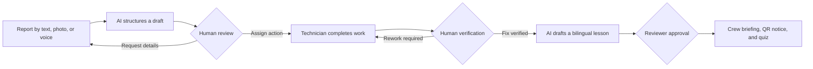

# SafeLoop AI

SafeLoop AI is a bilingual, human-controlled safety workflow for construction
sites. It turns a worker's typed or spoken observation into a traceable loop:
report, review, corrective action, verification, and a reusable crew lesson.

English and Simplified Chinese are first-class throughout the browser
experience. AI helps structure reports and draft learning content, but people
remain accountable for every safety decision.

## Live demo

[safe-loop-xiyan.vercel.app/en](https://safe-loop-xiyan.vercel.app/en/)

The hosted demo contains synthetic people and safety records only. Use any of
the accounts below with password `SafeLoopDemo!2026`.

| Experience | Email |
| --- | --- |
| Reporter | `reporter-en@example.test` |
| Safety reviewer | `reviewer@example.test` |
| Responsible technician | `responsible@example.test` |
| Crew member | `crew@example.test` |

## How the loop works



### For reporters

- File a safety observation in English or Simplified Chinese.
- Type the report or record voice with an editable transcript and typed fallback.
- Attach site photos and answer targeted clarification questions.
- Follow the case timeline and see what changed after closure.

### For reviewers and technicians

- Triage a priority-sorted review queue and escalate urgent cases.
- Approve, reject, or request more information with an auditable reason.
- Assign corrective work, owners, and due dates.
- Submit completion evidence, return inadequate work, and verify closure.
- Track overdue actions, alert acknowledgement, and operational metrics.

### For administrators and crews

- Upload, approve, retire, and search controlled PDF or DOCX procedures.
- Ground AI drafts in approved document revisions with visible citations.
- Review bilingual toolbox briefings and three-question quizzes before publishing.
- Download a noticeboard QR code or A4 sheet for each published briefing.
- Let crew members revisit active lessons and record quiz completion.

## Human-control guarantees

SafeLoop separates assistance from authority:

- AI may extract facts, ask clarifying questions, translate content, and draft
  reports or lessons.
- AI cannot approve, reject, assign, escalate, publish, or close a case.
- Only a human reviewer can accept corrective evidence and verify closure.
- AI-generated content stays visibly labelled until a reviewer approves it.
- Role-based access and database row-level security protect workflow boundaries.
- The stub AI provider keeps local development and automated tests deterministic.

## Run the complete demo locally

Install these prerequisites first:

- Docker Desktop
- Supabase CLI 2.115.0
- Python 3.12
- Node.js 22

Then run:

```bash
git clone https://github.com/xgsen609/Safe_Loop.git
cd Safe_Loop
bash scripts/demo.sh
```

On Windows PowerShell, replace the last command with:

```powershell
pwsh -File scripts/demo.ps1
```

The demo script installs dependencies, starts Supabase, applies every migration,
loads 40 synthetic reports, and starts the API and web app. Open
<http://127.0.0.1:3000/en> or <http://127.0.0.1:3000/zh-CN>.

> [!CAUTION]
> The public credentials and `supabase/demo_seed.sql` are for isolated demo
> environments only. Never load the demo seed into a project containing real
> people or safety reports.

## Technology

| Layer | Runtime and main components |
| --- | --- |
| Web app | Next.js 15, React 19, TypeScript, `next-intl` |
| API | Python 3.12, FastAPI, Pydantic, asyncpg |
| Workflow AI | LangGraph, Google Gen AI, deterministic local stub |
| Data platform | Supabase, PostgreSQL 17, pgvector, Storage, Auth |
| Production | Vercel, Google Cloud Run, Supabase Singapore region |

Pinned versions are in `backend/requirements.txt` and
`frontend/package-lock.json`.

## Project structure

```text
Safe_Loop/
├── backend/
│   ├── app/ai/          # intake, lesson, transcription, and evaluation flows
│   ├── app/api/         # FastAPI routes
│   ├── app/domain/      # roles, statuses, and allowed transitions
│   ├── app/rag/         # document chunking, embeddings, and retrieval
│   └── app/services/    # workflow and persistence services
├── frontend/
│   ├── app/[locale]/    # bilingual Next.js routes
│   ├── components/      # role-specific workflow UI
│   ├── lib/             # API, auth, and generated state-machine contract
│   └── messages/        # English and Simplified Chinese copy
├── supabase/
│   ├── migrations/      # schema, policies, storage, and workflow migrations
│   ├── seed.sql         # stable base profiles
│   └── demo_seed.sql    # synthetic end-to-end demo dataset
├── scripts/             # local demo and seed helpers
└── docs/                # deployment, operations, and terminology
```

## Manual development setup

### 1. Start the local platform

```bash
supabase start
supabase db reset --local
```

Copy `backend/.env.example` to `backend/.env` and
`frontend/.env.example` to `frontend/.env.local`. Fill them with the values from
`supabase status -o env`. Do not commit either environment file.

### 2. Start the API

macOS or Linux:

```bash
cd backend
python3 -m venv .venv
.venv/bin/python -m pip install -r requirements.txt
.venv/bin/python -m app.doctor
.venv/bin/python -m uvicorn app.main:app --reload
```

Windows PowerShell:

```powershell
cd backend
python -m venv .venv
.venv\Scripts\python -m pip install -r requirements.txt
.venv\Scripts\python -m app.doctor
.venv\Scripts\python -m uvicorn app.main:app --reload
```

The OpenAPI documentation is available at <http://127.0.0.1:8000/docs>.

### 3. Start the web app

In a second terminal:

```bash
cd frontend
npm ci
npm run dev
```

Normal browser use authenticates with Supabase JWTs. Debug authentication headers
work only when both `APP_ENV=local` and `ALLOW_DEBUG_AUTH=true`.

## Verification

Backend checks:

```bash
cd backend
python -m ruff check .
python -m mypy app --strict
python -m pytest
```

Frontend checks:

```bash
cd frontend
npm ci
npm run build
npm run tsc
npm run test
```

Database integration tests run when `TEST_DATABASE_URL` is set. The Playwright
suite refuses non-loopback Supabase URLs and runs with `AI_PROVIDER=stub`. CI
applies all migrations, exercises the complete English and Mandarin browser flow,
and loads the demo seed twice to prove that it is rerunnable.

The frontend builds against the committed `frontend/lib/stateMachine.ts` contract
without requiring a live backend. After changing backend transitions, start the
API, run `npm run generate-state-machine` in `frontend`, and review the generated
contract before committing it.

## Deployment and operations

Production is constrained to Singapore: Supabase in `ap-southeast-1`, Cloud Run in
`asia-southeast1`, and Vercel in `sin1`. The manually dispatched **Deploy
Singapore** workflow applies database migrations, deploys the API, and then deploys
the frontend. It rejects any configured runtime region outside Singapore.

- [Deployment guide](docs/DEPLOYMENT.md)
- [Production runbook](docs/RUNBOOK.md)
- [Safety glossary](docs/GLOSSARY.md)

The runbook covers rollback, key rotation, first-response checks, and degraded AI
or transcription providers. Core reporting and human decision paths remain
available when AI features are unavailable.

## Common startup issues

| Symptom | Resolution |
| --- | --- |
| `supabase` is not recognised | Install Supabase CLI 2.115.0 and restart the terminal. |
| Supabase cannot start | Start Docker Desktop and wait for its engine to become ready. |
| Python environment creation fails | Install 64-bit Python 3.12 and enable its launcher or PATH entry. |
| `npm` is not recognised | Install Node.js 22. |
| Doctor reports `DATABASE_URL` | Copy the local `DB_URL` or hosted session-pooler URL into `backend/.env`. |
| Doctor reports database reachability | Check the host, port, VPN, and Supabase network restrictions. |
| Doctor reports missing schema | Run `supabase db reset --local` or the tracked production migration workflow. |
| Demo sign-in fails | Apply `supabase/demo_seed.sql`; the base seed identities intentionally have no password. |
| Deep health reports storage | Create the private buckets and set the Supabase service-role key. |
| Deep health reports provider | Confirm Vertex AI is enabled in `asia-southeast1` and follow the runbook. |
